# Activity Tracker (Discord)

A Vencord / Equicord plugin that logs presence, activity, profile changes, and messages for selected users.

> **This is a fork** of [Ondra-D/vencord-activity-tracker](https://github.com/Ondra-D/vencord-activity-tracker).  
> All credit for the original plugin goes to **Ondra_D**.  
> This fork keeps the core tracking logic and heavily improves the UI + adds many quality-of-life features.

---

### Main Preview

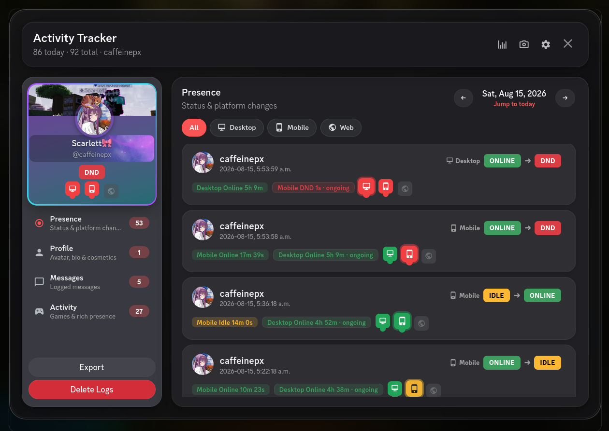

*Completely redesigned island-style history UI with profile cosmetics, multi-platform tracking, day timeline, and more.*

---

## Features

### Core (from original plugin)
- Presence/status change, Activity & rich presence, Profile change (avatar, banner, username, bio, etc.), Messages logging; and typing notifications with per-user settings & local history retention

### What this fork adds

**History UI**
- Island layout (sidebar + main panel)
- Separate views for Presence, Profile, Messages, and Rich Presence
- Day-by-day navigation
- Platform filter (Desktop / Mobile / Web)
- Live platform indicators
- Per-user or combined history
- Day timeline + stats charts

**Screenshot Mode**
- Redact / Blur / Black out identities
- Applies to history, timeline, stats, and settings

**Presence intelligence**
- Platform-specific timings and duration chips
- Platform-aware notifications
- “Potentially invisible” mobile detection

**Toolbar & Context Menu**
- Eye button in the channel toolbar (Equicord)
- Distinct icon when in a tracked user’s DM
- Cleaner context menu labels + icons

**Profile & Cosmetics**
- Activity Tracker section on user profiles
- Sidebar cosmetics island (banner, avatar decoration, nameplate, theme colors)

**Log safety**
- Append-only desktop logs (no more wiping history)
- Import / Export (export is per-user)
- Loads both new and legacy log folders

**UI Style Modes**
1. Full custom UI (plugin colors)
2. Custom UI + theme colors
3. Full Discord-native UI

---

## Previews

### History & Logs
| Activity Logs | Message Logs |
|---------------|--------------|
| 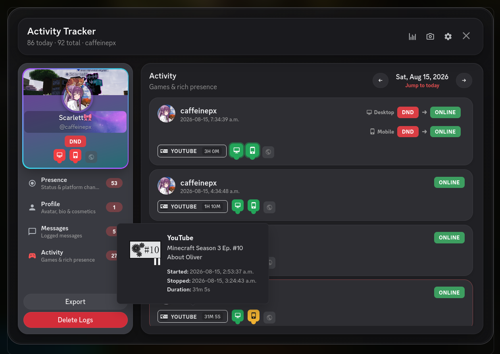 | 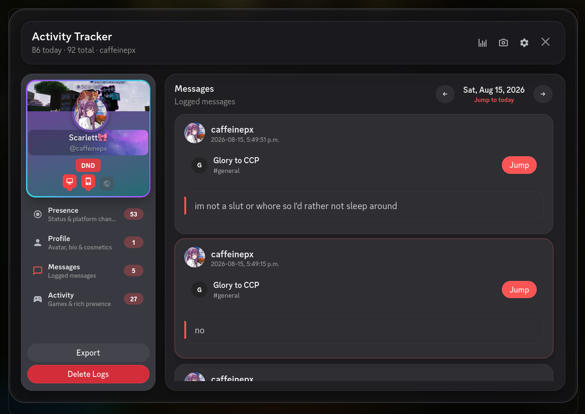 |

| Profile Logs | Profile Logs Preview |
|---------------|--------------|
| 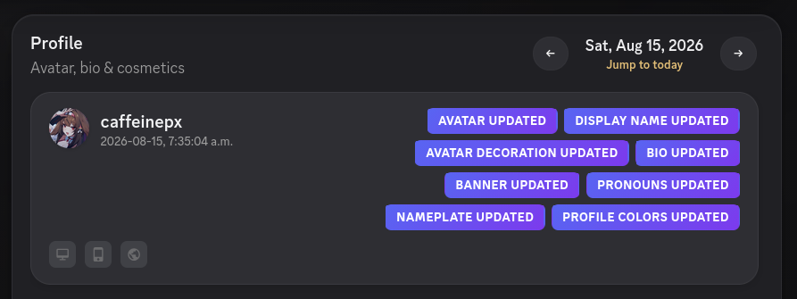 | 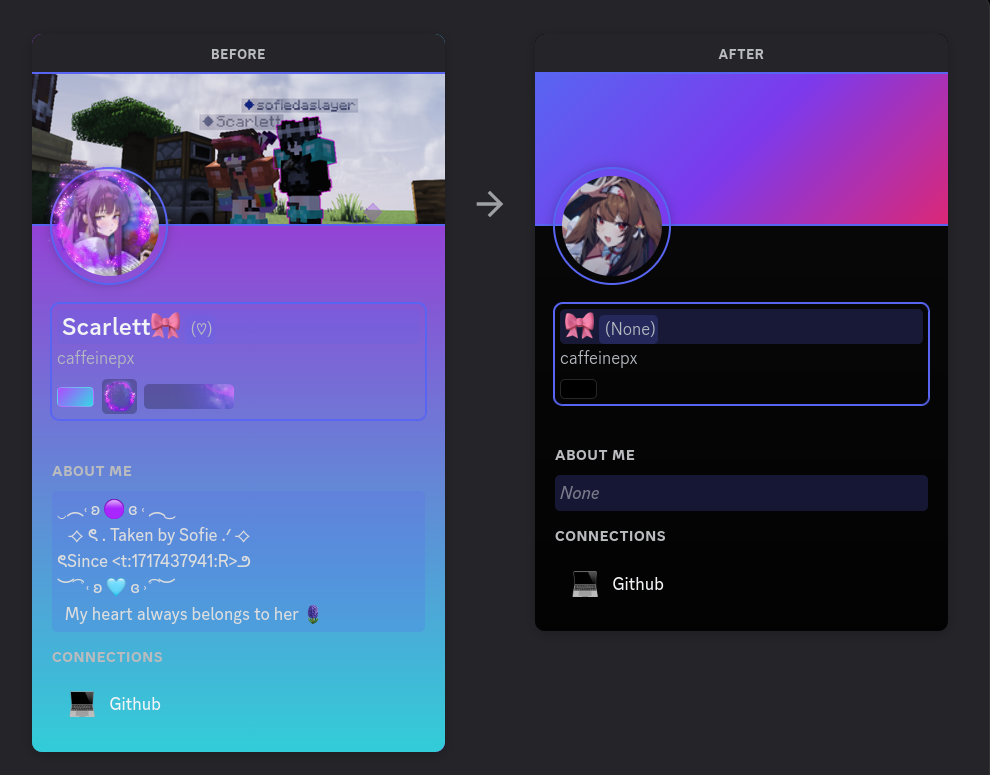 
### Timeline & Stats
| Timeline | Stats |
|----------|-------|
| 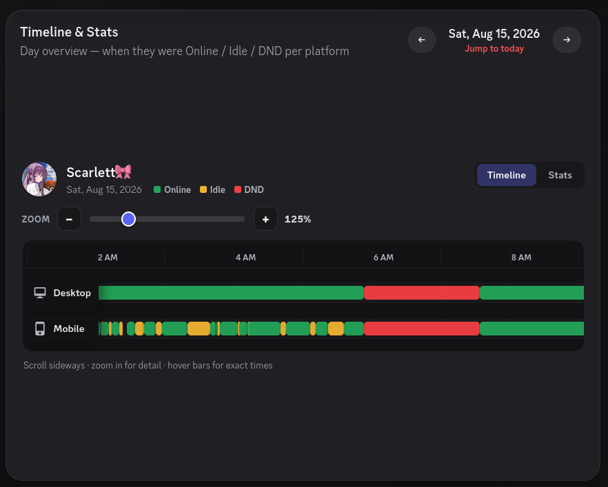 | 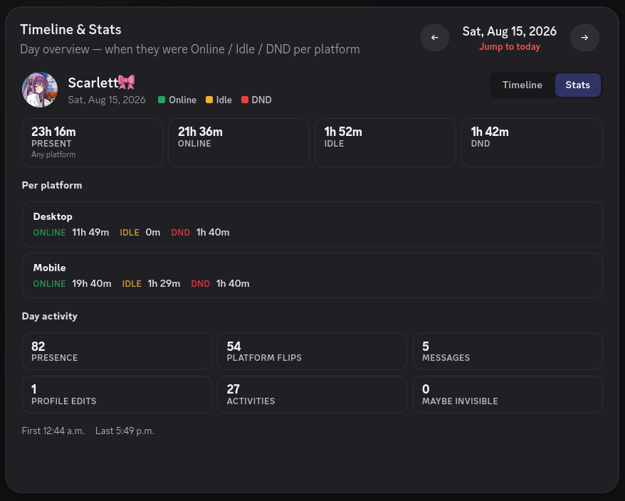 |

### Toolbar
| Always Visible | User-Specific (tracked DM) |
|----------------|----------------------------|
| 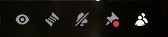 | 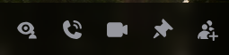 |

### Screenshot Mode & Settings
| Screenshot Mode | 
|-----------------|
| 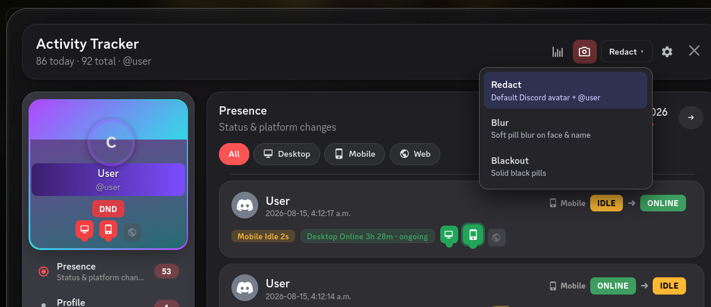 | 

| Plugin Settings | User Tracker Settings |
|-----------------|-----------------------|
| 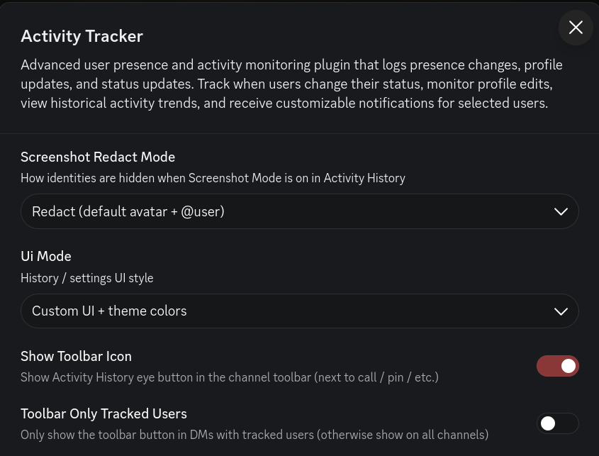 | 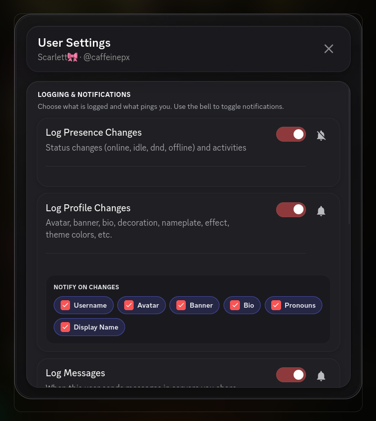 |

---

## Changelog

### 2026-08-11 — Profile cosmetics, safer logs, import
- Sidebar cosmetics island (banner, decoration, nameplate, theme)
- Tracking for avatar decoration / nameplate / profile effect / theme colors
- Import logs from exported JSON (merge + dedupe)
- Native append-only logging + multi-folder support
- Export now scoped to the selected user only
- Various duration-chip and scroll fixes

### 2026-08-11 — Multi-platform presence + Timeline/Stats
- Full day timeline (Desktop / Mobile / Web) with zoom
- Day stats tab (combined + per-platform)
- Platform-aware notifications and duration chips
- Three UI style modes
- Screenshot mode coverage for timeline & settings

### 2026-07-31 — Toolbar & context menu
- Channel toolbar eye button (Equicord HeaderBarAPI)
- Context-aware icon (tracked DM vs global)
- Settings for toolbar visibility
- Cleaner context menu labels + icons

### Earlier — Full UI redesign
- Island history modal
- Screenshot modes
- Platform device timings
- Profile overview section
- Logging reliability improvements

---

## Installation

### Equicord (recommended)
1. Clone / copy into `src/userplugins/activity-tracker`
2. Rebuild Equicord
3. Enable **Activity Tracker** (HeaderBarAPI required for toolbar button)

### Vencord
Follow the [official custom plugins guide](https://docs.vencord.dev/installing/custom-plugins/)  
or this [video](https://youtu.be/XmVNRKrphlw?si=XFwjkwU_1bMOjOUc).

> **Note:** Toolbar button requires Equicord’s `HeaderBarAPI`. Everything else works on plain Vencord.

---

## Usage

1. Right-click a user → **Track User**
2. Right-click a tracked user → **Presence History** or **Stop Tracking**
3. Use the **eye** button in the channel toolbar for quick access
4. Open plugin settings for retention, screenshot mode, toolbar options, and UI style
5. In history, click the chart button for **Timeline & Stats**

---

## License

See [LICENSE](./LICENSE).
