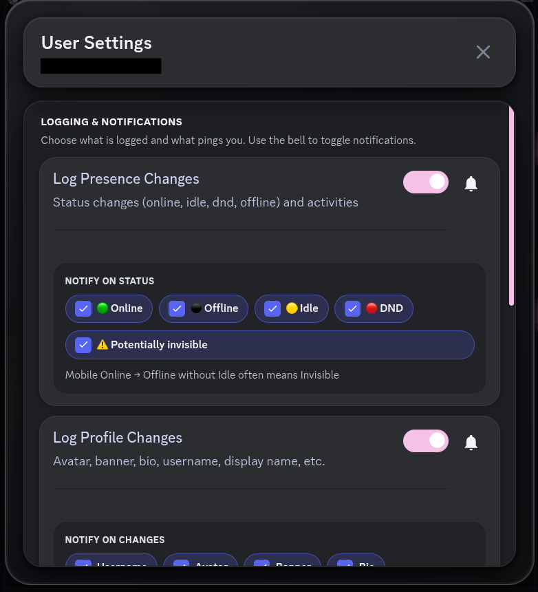
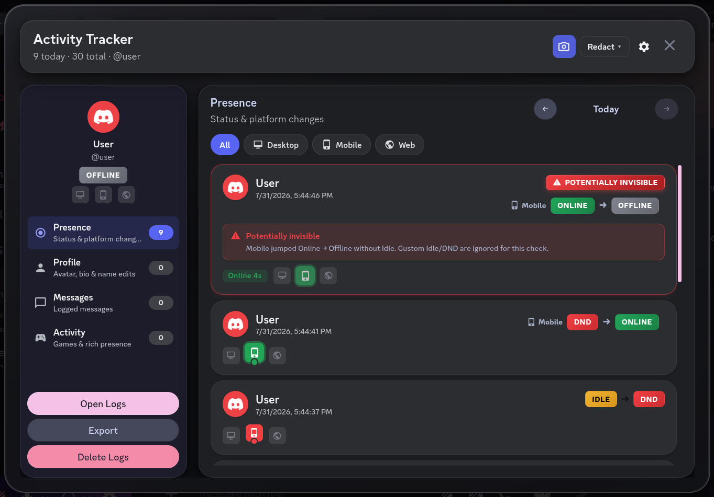
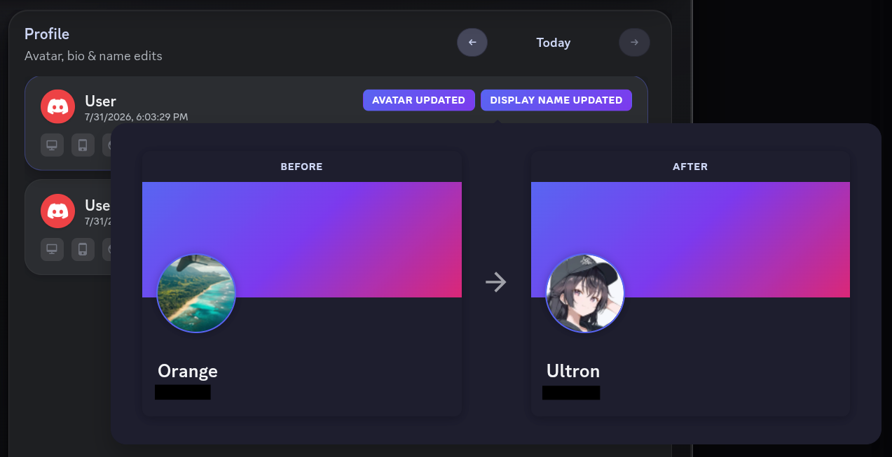
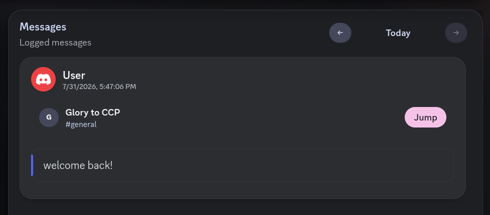

# Activity Tracker (Discord)

A Vencord / Equicord custom plugin that logs presence, activity, and profile changes for selected users.

Forked from [Ondra-D/vencord-activity-tracker](https://github.com/Ondra-D/vencord-activity-tracker/). All credit for the original plugin goes to Ondra_D. This fork builds on that work with UI and QoL improvements.

I think the fork has the core still but damn the UI is fully overhauled.

### **Just a small preview**:
- Main UI (Added Profile Stuff like banners, avatar deco, etc for a better sidebar + Better Tracking Times on Different Devices)

- Timeline for the day + Stats of the User

Rest of the Previews I'll update someday 

**This fork:** https://github.com/caffeinepx/activity-tracker-discord

## Features

### Core (original plugin)

- The core remains unchanged. Only extra changes and new features added!

### What this fork adds / improves

#### History UI

- **Island layout** — sidebar + main panel as rounded “islands” on a shared backdrop (dark mica-style shell)
- **Sectioned history** — Presence, Profile, Messages, Rich presence as separate sidebar views
- **Day navigation** — browse logs day-by-day with previous / next
- **Platform filter** — filter presence by desktop / mobile / web
- **Live platform strip** — device indicators for the focused user
- **Per-user open** — open history for one user (context menu / toolbar) or the combined log
- **Open Logs / Snapshots / Settings** from the history modal sidebar
- **Day timeline & stats** — chart of Online / Idle / DND per platform across the day (zoom + scroll), plus combined and per-platform totals

#### Screenshot Mode

- Toggle in the history modal to hide identities for screenshots / sharing
- Modes: **Redact** (default avatar + generic name), **Blur**, **Black out**
- Default mode stored in plugin settings
- Applies to history list, timeline/stats titles, and user settings when opened from history

#### Presence intelligence

- **Platform / device timings** — which devices were online and when, with under-icon ongoing indicators
- **Platform-aware notifications** — e.g. “Online on Mobile”, “Idle on Desktop”, with other platforms still listed
- **Platform-specific duration chips** — e.g. `Mobile Online 2h 14m` instead of vague “Session Online”
- **Potentially invisible** heuristic — mobile Online → Offline (without idle/dnd) flagged in history and notifications
- More reliable disk log load (including deferred load after native module registers)

#### Channel toolbar button (Equicord HeaderBarAPI)

- Eye button next to call / pin / etc.
- **Tracked user DM** → opens **that user’s** presence history (distinct eye + person icon)
- **Other channels** → opens **combined** activity history (plain eye)
- Theme-aware colors via Discord tokens (`--icon-muted`, hover tokens)
- Settings:
  - Show / hide toolbar button
  - **Only show on tracked users’ DMs** (optional)

#### Context menu QoL

- **Track User** / **Stop Tracking** (short labels) with eye / eye-off icons
- **Presence History** with clock icon
- Same actions as before; clearer labels and icons

#### Profile overview

- Activity Tracker section on tracked user profiles (online duration / last seen, platform row, quick open history)

#### UI style modes

Plugin setting **History / settings UI style**:

1. **Full custom UI (plugin colors)** — islands + mica + plugin palette (default)
2. **Custom UI + theme colors** — same layout, colors follow Discord / client theme
3. **Full theme compatibility (Discord-native UI)** — flat modal, no custom islands/mica

#### Profile cosmetics (sidebar card)

- Mini profile **island** for the focused user: banner strip, avatar + shop decoration, theme gradient fill + border ring, nameplate behind the name
- Tracks decoration / nameplate / profile effect / theme colors in the Profile section (same change-log path as avatar/banner)
- Profile **frames** are intentionally not tracked or rendered (Discord payloads thrash and false-fire)

#### Log safety & import/export

- **Append-only** desktop log files (no full-file rewrite on every event — that used to wipe history)
- Loads from `ActivityTrackerLogs` **and** legacy `StalkerLogs`, plus sibling client folders (Equicord ↔ equibop) when present
- **Import** sidebar button — merge a previously exported JSON into storage without deleting anything
- **Export** is scoped to the selected user (not every loaded user)

---

## Screenshots (OUTDATED)

---

## Changelog

### 2026-08-11 — Profile cosmetics island, log import, safer disk history

**Added**

- Sidebar **cosmetics island** (banner, avatar decoration, theme gradient + ring, nameplate)
- Tracking for **avatar decoration**, **nameplate**, **profile effect**, and **theme colors** in Profile history
- Timeline/stats header **user avatar** (screenshot-mode aware)
- **Import** logs from an exported JSON (merge + dedupe; adds users to the track list)
- Native **append-only** logging and multi-folder read (`ActivityTrackerLogs` / `StalkerLogs` / sibling clients)
- Themed thin **horizontal scrollbar** on the day timeline (matches presence ScrollerThin look)

**Changed**

- Profile change bursts are debounced (~600ms) into a single history entry
- Export only includes the **selected user’s** entries; filename uses username when available
- Browser log storage soft cap raised so large imports are not immediately trimmed

**Fixed**

- Desktop log writes no longer rewrite the whole file every event (that could wipe older history)
- Export no longer dumps every loaded user under one user’s filename
- Duplicate presence duration chips (e.g. three identical `Mobile Online` pills) are collapsed to one per device
- Scrollable sidebar nav when the cosmetics island is tall (Activity tab stays reachable)

**Not included**

- Discord **profile frames** — not rendered and not logged (unreliable API surface)

### 2026-08-11 — Multi-platform presence, timeline/stats, UI modes

**Added**

- Day **timeline** (Desktop / Mobile / Web rows, 12h AM/PM axis, zoom slider, sticky row labels)
- Day **stats** tab (combined union times, per-platform Online/Idle/DND, event counts)
- Header chart button to open Timeline & Stats (shares day navigation with the log feed)
- **Platform-aware presence notifications** (which device flipped, what’s still active)
- **Platform-specific duration chips** in history (`Mobile Online …`, etc.)
- UI mode dropdown: full custom / custom + theme colors / full theme compatibility
- Screenshot mode coverage for timeline titles and user-settings identity line

**Changed**

- Overall “Session Online” duration is no longer the default label when a platform can be attributed
- Presence logging records `platformChanges` / `platformDurations` for multi-device sessions
- Toolbar and history continue to support per-user vs combined open paths

**Fixed**

- Device-only presence updates no longer falsely notify as a generic “is Online”
- Overall online duration is only stamped on full online/offline session boundaries (not every platform flip)

### 2026-07-31 — Toolbar, context menu, context-aware history

_Code changes since the feature work that landed in the first publish (previews on `main` were asset/README only)._

**Added**

- Channel toolbar **eye** button (HeaderBarAPI / channel toolbar)
- **Eye + person** icon when the current channel is a DM with a tracked user
- Setting: **Show toolbar icon**
- Setting: **Only show on tracked users’ DMs**
- Context menu icons: eye, eye-off, history clock
- Theme-compatible toolbar coloring (`currentColor` + `--icon-muted` / hover)

**Changed**

- Context menu labels: `Stop Tracking`, `Presence History` (was “Stop Tracking User” / “View Presence History”)
- Clicking the toolbar button in a **tracked DM** opens **that user’s** history, not the global combined view
- Toolbar icon design switches based on context (global vs per-user)

**Fixed**

- Toolbar icon now follows Discord / custom theme icon tokens instead of hardcoded colors

### Earlier (included in initial publish) — UI redesign & tracking depth

Compared to the original Activity Tracker plugin:

- Full **islands** history modal redesign + dark shell polish
- Screenshot mode (redact / blur / blackout)
- Platform device timings + under-dot ongoing indicators
- Potentially-invisible mobile transition detection
- Logging reliability improvements (native helper load, safer snapshots)
- Profile overview section for tracked users
- Day browser, section sidebar, per-user settings panel polish

### 2026-07 — Preview assets & fork credit

- Updated screenshot previews (settings, presence, RPC, profile, messages)
- README credit for the original Ondra-D plugin

---

## Installation

### Equicord (recommended for toolbar button)

1. Clone or copy this repo into `src/userplugins/activity-tracker` (or similar).
2. Rebuild Equicord.
3. Enable **Activity Tracker** and ensure **HeaderBarAPI** is available (listed as a dependency).

### Vencord

Read the custom plugins guide:  
https://docs.vencord.dev/installing/custom-plugins/

Or follow: https://youtu.be/XmVNRKrphlw?si=XFwjkwU_1bMOjOUc

> **Note:** The channel toolbar button uses Equicord’s `HeaderBarAPI`. On plain Vencord, core tracking / history / context menu still work; the toolbar eye may require Equicord or an equivalent API.

## Usage

1. Right-click a user → **Track User**
2. Right-click a tracked user → **Presence History** or **Stop Tracking**
3. Use the **eye** in the channel toolbar for quick history access
4. Open plugin settings for retention, screenshot default mode, toolbar visibility, and **UI style**
5. In Activity History, use the chart button for **Timeline & Stats**

## License

See [LICENSE](./LICENSE).
